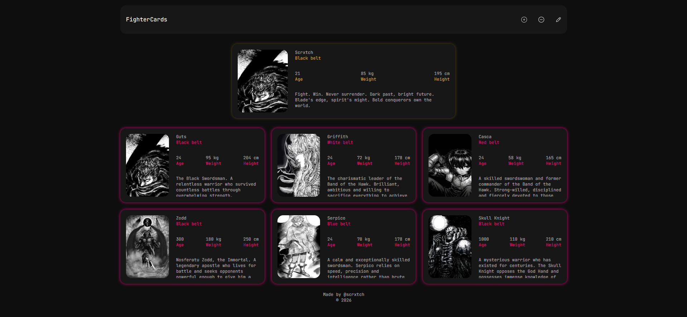

# 🥋 FighterCards — V2

A modern and responsive web project focused on presenting fighters in a clean, interactive and visually engaging way.

This project is the **second and improved version** of the original application. The current version is being actively refactored and redesigned with a stronger focus on cleaner code, reusable components, responsive UI and a better overall user experience.

## 🛠️ Tech Stack

> ⚠️ **Work in Progress**
>
> This project is currently **under active development**. Some parts of the application are still being refactored, redesigned or improved. The current version should therefore be considered an unfinished development version.

---

## ✨ Features

- 🥋 Fighter profile cards
- 📱 Fully responsive design
- 🎨 Modern UI built with Tailwind CSS
- ⚡ Fast static site generation with Astro
- 📦 Fighter data stored separately in a JSON-based data structure
- 🧩 Reusable Astro components
- 🖼️ Optimized images using Astro Assets
- 📥 Ability to export/download fighter cards as images
- 🔄 Continuous refactoring and improvements
- 🧱 Component-based architecture
- 🌓 Prepared for future UI and functionality improvements

---

### Core Technologies

| Technology | Purpose |
|---|---|
| **Astro** | Main framework and component architecture |
| **Tailwind CSS** | Styling, responsive layout and UI design |
| **TypeScript** | Type-safe application logic |
| **HTML5** | Semantic page structure |
| **CSS3** | Styling and visual effects |
| **JSON** | Storage of fighter data |
| **Astro Assets** | Image optimization and asset handling |

---

## 📊 Data Architecture

One of the main goals of this version is to keep **content separate from the UI**.

All displayed fighter information is stored separately in a JSON-based data structure rather than being hardcoded directly into the components.
